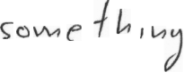

# Handwritten Text Recognition (word_level) using TensorFlow

 `The documentation for this repository can find it`  [here](https://drive.google.com/file/d/1jII2ZzBhIq1kOPdywM7ugx3FwyoTGQZE/view?usp=sharing)   OR   `You can find it in doc section`

### Description:
Handwritten Text Recognition (HTR) system implemented with TensorFlow (TF) and trained on the IAM off-line HTR dataset.
This Neural Network (NN) model recognizes the text contained in the images of segmented words as shown in below (MOVE).
As these word-images are smaller than images of complete text-lines, the NN can be kept small and training on the CPU is feasible.
80% of the words from the validation-set are correctly recognized and the character error rate is around 10%. I used Correction function which using English dictionary to try improve output.  


## How the output look like (Demo of Model)
###### First prepare the environment through requirement section, the data through Training model section and, model by downloading the model from .[here](https://drive.google.com/file/d/118hx_QdXvYZqofkiwcmoQileWQLjrTB-/view?usp=sharing). and replace it with the model folder in the project. 

The input image (something) and the expected output is shown below.



##### Go to the src/ directory and execute to Prediction
```markdown
$ python main.py
```
```
> python3 main.py
Validation character error rate of saved model: 10.285918%
Python: 3.6.0 (v3.6.0:41df79263a11, Dec 22 2016, 17:23:13) 
[GCC 4.2.1 (Apple Inc. build 5666) (dot 3)]
Tensorflow: 1.12.0
2020-03-11 19:44:41.239147: I tensorflow/core/platform/cpu_feature_guard.cc:141] Your CPU supports instructions that this TensorFlow binary was not compiled to use: AVX2 FMA
Init with stored values from ../model/snapshot-16
Recognized without Correction: "something"
Recognized With Correction:  something 
Probability: 0.8088909


```

# Requirements

The project tested with:

* Python 3
* TensorFlow (TF) 1.12.0
* Numpy 1.12.0 OR 1.13 OR 1.16.1
* OpenCV 4.0.0.21
* editdistance 0.5.2
* autocorrect 0.4.4
* MacOS Catalina 10.15.1 OR Windows
* Model trained on TU Berlin Cluster (HPC)  [website](https://hpc.tu-berlin.de/doku.php?id=hpc:hardware).

###### You can find the libraries in`requirements.txt`file


## Train model 

### IAM dataset was used

The data-loader expects (the IAM) dataset in the `data/` directory.

#### Follow these instructions to get the dataset:

1. Register for free at this [website](http://www.fki.inf.unibe.ch/databases/iam-handwriting-database).
2. Download `words/words.tgz`.
3. Download `ascii/words.txt`.
4. Put `words.txt` into the `data/` directory in the project folder.
5. Create the directory in the project folder `data/words/`.
6. Put the content of `words.tgz` into `data/words/`.


#### To Train the model from scratch

###### But if you want to train the model from scratch go through the instructions in requirement section to prepare the environment then through Train model section to prepare the data. Then >>> go to the `src/` directory and execute `python main.py --train`.After each epoch of training, validation is done on a validation set.If you only want to do validation given a trained NN, execute `python main.py --validate`.

To train the model 
```markdown
$ python main.py --train

```
To validate the model
```markdown
$ python main.py --validate
```

###### Training the model will look like this:-
```
> python main.py --train
Tensorflow: 1.12.0
Init with stored values from ../model/snapshot-16
Epoch: 1
Train neural network
Batch: 1 / 500 Loss: 0.7359167
Batch: 2 / 500 Loss: 12.021976
Batch: 3 / 500 Loss: 26.108364
Batch: 4 / 500 Loss: 124.031944
Batch: 5 / 500 Loss: 181.35434
Batch: 6 / 500 Loss: 119.89872
Batch: 7 / 500 Loss: 81.92832
Batch: 8 / 500 Loss: 52.695866
Batch: 9 / 500 Loss: 65.09529
Batch: 10 / 500 Loss: 27.82657
Batch: 11 / 500 Loss: 23.529512
Batch: 12 / 500 Loss: 16.984976
Batch: 13 / 500 Loss: 20.721413
Batch: 14 / 500 Loss: 17.627195
Batch: 15 / 500 Loss: 17.950825
...

Validate neural network
Batch: 1 / 115
Ground truth -> Recognized
[OK] "bit" -> "bit"
[OK] "," -> ","
[OK] "Di" -> "Di"
[OK] "," -> ","
[OK] """ -> """
[OK] "he" -> "he"
[OK] "told" -> "told"
[OK] "her" -> "her"
[OK] "." -> "."
[ERR:3] """ -> "Iut"
[ERR:3] "But" -> "I"
[ERR:1] "I" -> "."
[OK] "want" -> "want"

...

Character error rate: 10.294839%. Word accuracy: 74.573913%.
Character error rate not improved
No more improvement since 5 epochs. Training stopped.
```


###### Trained on the CPU takes 48 hours on my system (MacOS Catalina, 8GB of RAM and core i5 running at 2.4GHz). but When I have used TU Berlin Cluster the training taken 10 hours.


## Command line arguments that can used it

* `--train`: train the NN, details see below.
* `--validate`: validate the NN, details see below.
* `--beamsearch`: use vanilla beam search decoding (better, but slower) instead of best path decoding.
* `--wordbeamsearch`: use word beam search decoding (only outputs words contained in a dictionary) instead of best path.
* `--dump`: dumps the output of the NN to CSV file(s) saved in the dump/ folder.


## References 

1. IAM Dataset http://www.fki.inf.unibe.ch/databases/iam-handwriting-database.
2. https://towardsdatascience.com/intuitively-understanding-connectionist-temporal-classification-3797e43a86c.
3. https://towardsdatascience.com/build-a-handwritten-text-recognition-system-using-tensorflow-2326a3487cd5.
4. https://github.com/lamhoangtung/LineHTR
5. https://towardsdatascience.com/faq-build-a-handwritten-text-recognition-system-using-tensorflow-27648fb18519. 
6. https://github.com/arthurflor23/handwritten-text-recognition
7. https://repositum.tuwien.ac.at/obvutwhs/download/pdf/2874742
8. https://repositum.tuwien.ac.at/obvutwoa/download/pdf/2774578


###### This is part of my machine learning project of Computer Science Program at TU Berlin. WiSe 2019/2020